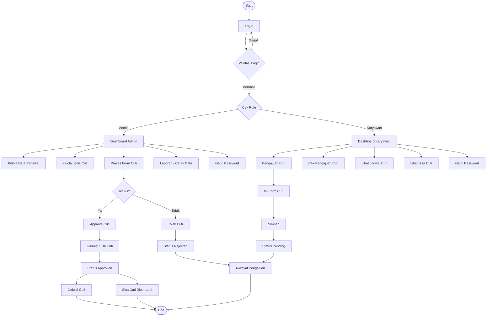

# 📌 Sistem Pengajuan Cuti Karyawan E-Cuti PT Maju Bersama

Aplikasi **E-Cuti PT Maju Bersama** adalah sistem berbasis web yang dirancang untuk mempermudah proses pengajuan, pengecekan, persetujuan, penolakan, penjadwalan, pencetakan laporan, dan monitoring sisa cuti pegawai. Sistem ini membantu admin dan karyawan mengelola data cuti secara lebih rapi, terpusat, dan otomatis melalui database.

## 🚀 Fitur Utama

- **Login Admin & Karyawan**  
  Pengguna dapat masuk ke sistem sesuai role masing-masing.

- **Dashboard**  
  Menampilkan ringkasan data dari database, seperti total pegawai, total pengajuan, pengajuan menunggu approval, dan jumlah pengajuan yang disetujui.

- **Pengajuan Cuti**  
  Karyawan dapat mengajukan cuti dengan mengisi NIK, jenis cuti, tanggal pengajuan, tanggal mulai cuti, lama cuti, dan alasan cuti.

- **Cek Pengajuan Cuti**  
  Karyawan dapat melihat status pengajuan cuti, seperti **Pending**, **Approved**, atau **Rejected**.

- **Proses Form Cuti**  
  Admin dapat memproses pengajuan cuti melalui tombol **Approve** atau menolak pengajuan. Jika pengajuan disetujui, sisa cuti pegawai akan otomatis berkurang sesuai lama cuti yang diajukan.

- **Lihat Jadwal Cuti**  
  Menampilkan daftar jadwal cuti. Pengajuan yang belum diproses admin tetap ditampilkan dengan status **Pending**, sedangkan pengajuan yang sudah disetujui tampil sebagai **Approved**.

- **Lihat Sisa Cuti**  
  Menampilkan sisa cuti pegawai. Data sisa cuti otomatis diperbarui setelah pengajuan disetujui oleh admin.

- **Manajemen Data Pegawai**  
  Admin dapat menambah, mengubah, mencari, menghapus, dan mencetak data pegawai.

- **Manajemen Jenis Cuti**  
  Admin dapat menambah, mengubah, menghapus, dan mencetak data jenis cuti.

- **Cetak Data / Laporan**  
  Sistem menyediakan fitur cetak data pegawai, jenis cuti, pengajuan cuti, jadwal cuti, dan sisa cuti.

- **Ganti Password**  
  Admin dan karyawan dapat mengganti password akun masing-masing.

## 👥 Role Pengguna

### Admin / Administrator

- Mengelola data pegawai.
- Mengelola data jenis cuti.
- Melihat seluruh data pengajuan cuti.
- Menyetujui atau menolak pengajuan cuti.
- Memproses form cuti melalui tombol **Approve**.
- Melihat jadwal cuti pegawai.
- Melihat dan memantau sisa cuti pegawai.
- Mencetak laporan data cuti.
- Mengganti password akun.

### Karyawan

- Mengajukan cuti melalui form pengajuan cuti.
- Melihat status pengajuan cuti.
- Melihat jadwal cuti.
- Melihat sisa cuti pribadi.
- Mengganti password akun.

# Live Demo
Aplikasi dapat diakses secara online:

🔗 http://cutiatmptmajubersama.infinityfree.me/

Silakan login menggunakan akun yang tersedia untuk mencoba fitur sistem.

## 🔄 Flowchart Sistem

Flowchart berikut menggunakan **Mermaid**, sehingga dapat tampil otomatis di GitHub atau editor Markdown yang mendukung Mermaid.



## 🗂️ Modul Sistem

- Dashboard
- Master Data Pegawai
- Master Jenis Cuti
- Pengajuan Cuti
- Cek Pengajuan Cuti
- Lihat Jadwal Cuti
- Lihat Sisa Cuti
- Proses Form Cuti
- Ganti Password
- Cetak Laporan

## 🛠️ Teknologi yang Digunakan

- PHP Native
- MySQL
- HTML
- CSS
- JavaScript
- Bootstrap
- XAMPP / Localhost

## ⚙️ Cara Menjalankan Program

1. Extract folder project **e-Cuti** ke dalam folder `htdocs` XAMPP.

   Contoh lokasi:

   ```text
   C:\xampp\htdocs\e-Cuti
   ```

2. Jalankan **Apache** dan **MySQL** melalui XAMPP Control Panel.

3. Buka **phpMyAdmin** melalui browser.

4. Buat database baru dengan nama:

   ```text
   dbcuti
   ```

5. Import file database:

   ```text
   dbcuti.sql
   ```

6. Pastikan konfigurasi koneksi database sudah sesuai pada file:

   ```text
   function/koneksi.php
   ```

   Konfigurasi default:

   ```text
   Host     : localhost
   User     : root
   Password : kosong
   Database : dbcuti
   ```

7. Buka aplikasi melalui browser:

   ```text
   http://localhost/e-Cuti/
   ```

## 🔐 Akun Login Contoh

### Admin

```text
Username : admin
Password : admin
```

### Karyawan

```text
Username : 2012231035
Password : 123456
```

## ⚠️ Catatan Sistem

- Approval dan penolakan pengajuan cuti hanya dapat dilakukan oleh admin.
- Pengajuan yang belum diproses admin akan tetap berstatus **Pending**.
- Pengajuan yang disetujui akan berubah menjadi **Approved**.
- Pengajuan yang ditolak akan berubah menjadi **Rejected**.
- Sisa cuti hanya berkurang setelah admin melakukan **Approve**.
- Pengurangan sisa cuti mengikuti jumlah lama cuti yang diajukan.
- Pengajuan yang sudah diproses tidak akan mengurangi sisa cuti dua kali.
- Angka pada dashboard dihitung langsung dari database.
- Jika tabel pegawai kosong, total pegawai akan tampil **0**.
- Jika belum ada pengajuan yang disetujui, jumlah disetujui akan tampil **0**.
- Tampilan tabel sudah dibuat rata tengah dan diberi garis agar lebih rapi.
- Warna tombol dan tampilan dibuat konsisten mengikuti tema aplikasi **E-Cuti PT Maju Bersama**.

## ✨ Catatan Tambahan

Pastikan konfigurasi database dan koneksi sudah sesuai agar aplikasi dapat berjalan dengan baik tanpa error. Jika data pada dashboard tidak berubah, periksa kembali isi tabel pada database `dbcuti` di phpMyAdmin.

## 👨‍💻 Author

Dibuat oleh: **Cinta Alifia Putri**
